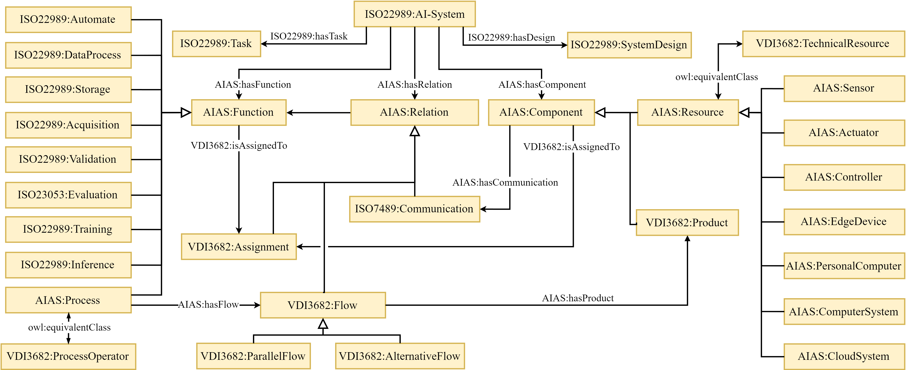
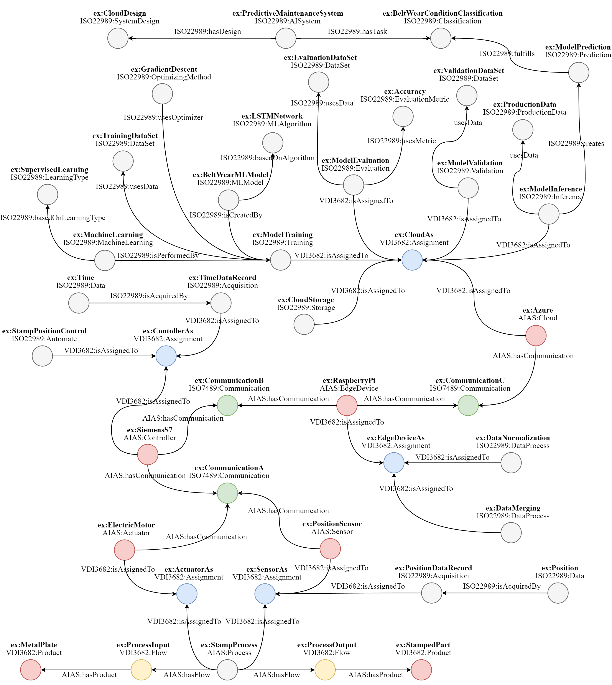

# Formal Model for Artificial Intelligence Applications in Automation Systems
> [!NOTE]
> This repo and project is still under development.

The presented information model allows to create a formal documentation of an AI application within an automation system.

## Motivation and Introduction
> [!NOTE]
> tbd. (will be described as soon as the publication process is completed)

## Concept and Competency Questions
> [!NOTE]
> tbd. (will be described as soon as the publication process is completed)

## Ontology Design Patterns
For this model, several ontology design patterns were used. The ODPs used can be categorized into two categories to describe various aspects of the AI System.

- **Technical System and Technical Process**: Contains terms and relationships to describe the technical system structure and the underlying processes, using the [VDI3682 ODP](odps/VDI3682-ODP.md) to describe the technical system overall and the [ISO7489 ODP](odps/ISO7489-ODP.md) to specify the communication between to system components.

- **Artificial Intelligence and Data**: Contains terms and relationships to describe the AI components and functions using the [ISO22989 ODP](odps/ISO22989-ODP.md).

The files of the respective are here: [ODPs files](https://github.com/schiesem/aias-information-model/tree/main/odps).

## Alignment Ontology
To create an information model capable of describing AI applications within automation systems, linking the two presented categories is needed. To achieve this, an alignment ontology that connects the contents of multiple OPDs is created, called [AIAS](https://github.com/schiesem/aias-information-model/blob/main/AIAS.owl). It is created by importing all previously mentioned ontologies via owl:import statements. This way, all ODPs remain in their own namespaces. The AIAS is shown in Fig. 1.

| |
|:--:|
| Fig. 1: Alignment Ontology of AIAS |

## Example and Usage
In this section, an example use case is modeled to demonstrate the usage of the information model. For the modeling, the tool Protégé is used.

### Use Case Example
The use case is based on a stamping process done by a stamping machine. The business goal of the use case is to reduce the maintenance costs of the stamp machine. The mentioned stamping machine is used to stamp parts out of blank metal sheets for the automobile industry. The machine consists of a support frame, a fixed lower die and a movable upper die. The upper die is moved by an electric motor, which is mounted on the support frame. The driving force is transmitted via a drive belt and the position of the upper die is measured via a positional sensor. Over time, the drive belt wears out, which leads to the upper die no longer being controlled with sufficient precision. As a result, parts being produced are often unable to satisfy the strict tolerance requirements. For this reason, the drive belt is currently replaced regularly at fixed intervals, but this maintenance strategy results in high maintenance costs. Therefore, the business goal of the use case is to reduce the maintenance costs of the stamping machine by gradually classifying the drive belt condition.

Some experiments have shown that a worn drive belt causes the upper die to oscillate when it is positioned. Based on that, the measured positioning values recorded during the stamping process by the sensors can be used to infer the belt wear condition.

The sensors transmit its data to a controller via a bus network. For the analysis of this position data, an AI application was developed based on a neuronal network. The neural network was trained in a cloud and deployed to an edge device, where the inference is also done. The edge device is connected via a local area network with the controller of the stamp machine. The edge device is also connected via internet with the cloud.

### Graph of the Example

| |
|:--:|
| Fig. 1: Simplified representation of the graph created by the use case|

### Creating the Individuals
Components

|Class|Individual|
|:---|:---|
|AIAS:Sensor    | <ins>ex:PositionSensor</ins> +|
|AIAS:Actuator  | <ins>ex:ElectricMotor</ins>  +|
|AIAS:Controller| <ins>ex:SiemensS7</ins>      +|
|AIAS:EdgeDevice| <ins>ex:RaspberryPI</ins>    +|
|AIAS:Cloud     |<ins>ex:Azure</ins>           +|
|VDI3682:Product|<ins>ex:MetalPlate</ins>      +|
|VDI3682:Product|<ins>ex:StampedPart</ins>     +|

Functions

|Class|Individual|
|:---|:---|
|ISO22989:Automate|<ins>ex:StampPositionAutomation</ins>  +|
|ISO22989:Normalization|<ins>ex:DataNormalization</ins>   +|
|ISO22989:Merging|<ins>ex:DataMerging</ins>               +|
|ISO22989:Storage|<ins>ex:CloudStorage</ins>              +|
|ISO22989:Acquisition|<ins>ex:PositionDataRecord</ins>    +|
|ISO22989:Acquisition|<ins>ex:TimeDataRecord</ins>        +|
|ISO22989:Validation|<ins>ex:ModelValidation</ins>        +|
|ISO22989:Evaluation|<ins>ex:ModelEvaluation</ins>        +|
|ISO22989:Training|<ins>ex:ModelTraining</ins>            +|
|ISO22989:Inference|<ins>ex:ModelInference</ins>          +|
|ISO22989:Prediction|<ins>ex:ModelPrediction</ins>        +|
|AIAS:Process|<ins>ex:StampProcess</ins>                  +|

Relations

|Class|Individual|
|:---|:---|
|ISO7489:Communication|<ins>ex:ControllerSensorCom</ins>      +|
|ISO7489:Communication|<ins>ex:ControllerActuatorCom</ins>    +|
|ISO7489:Communication|<ins>ex:ControllerEdgeDevCom</ins>     +|
|ISO7489:Communication|<ins>ex:EdgeCloudCom</ins>             +|
|VDI3682:Flow |<ins>ex:StampInput</ins>                       +|
|VDI3682:Flow |<ins>ex:StampOutput</ins>                      +|
|ISO7489:Assignment|<ins>ex:AutomateDeployment</ins>|
|ISO7489:Assignment|<ins>ex:NormalizationDeployment</ins>|
|ISO7489:Assignment|<ins>ex:StorageDeployment</ins>|
|ISO7489:Assignment|<ins>ex:AcquisitionDeployment</ins>|
|ISO7489:Assignment|<ins>ex:ValidationDeployment</ins>|
|ISO7489:Assignment|<ins>ex:EvaluationDeployment</ins>|
|ISO7489:Assignment|<ins>ex:TrainingDeployment</ins>|
|ISO7489:Assignment|<ins>ex:InferenceDeployment</ins>|
|ISO7489:Assignment|<ins>ex:ProcessDeployment</ins>|
|ISO7489:Assignment|<ins>ex:TimeDataRecordDeployment</ins>|
|ISO7489:Assignment|<ins>ex:PositionDataRecordDeployment</ins>|
|ISO7489:Assignment|<ins>ex:DataMergingDeployment</ins>|

Artificial Intelligence Functions

|Class|Individual|
|:---|:---|
|ISO22989:AISystem|<ins>ex:PredictiveMaintenanceStamp</ins>             +|
|ISO22989:Classification| <ins>ex:BeltWearConditionClassification</ins> +|
|ISO22989:MLModel |<ins>ex:BeltWearConditionModel</ins>                 +|
|ISO22989:MLAlgorithm |<ins>ex:LongShortTermMemoryNetwork</ins>         +|
|ISO22989:Modelparameter|<ins>ex:InputLayer</ins>                       +|
|ISO22989:Modelparameter|<ins>ex:HiddenLayer1</ins>|
|ISO22989:Modelparameter|<ins>ex:HiddenLayer2</ins>|
|ISO22989:Modelparameter |<ins>ex:OutputLayer</ins>|
|ISO22989:Modelparameter|<ins>ex:Sigmoid</ins>|
|ISO22989:MachineLearning|<ins>ex:MachineLearning</ins>                 +|
|ISO22989:SupervisedLearning|<ins>ex:SupervisedLearning</ins>           +|
|ISO22989:GradientDescent|<ins>ex:GradientDescent</ins>                 +|
|ISO22989:Hyperparameter|<ins>ex:LearningRate</ins>|
|ISO22989:Hyperparameter|<ins>ex:BatchSize</ins>                        +|
|ISO22989:EvaluationMetric|<ins>ex:Accuracy</ins>                       +|

Data

|Class|Individual|
|:---|:---|
|ISO22989:Sample|<ins>ex:Postion</ins>                                  +|
|ISO22989:Sample|<ins>ex:Time</ins>                                     +|
|ISO22989:TrainingData |<ins>ex:TrainingData</ins>                      +|
|ISO22989:ValidationData |<ins>ex:ValidationData</ins>|
|ISO22989:EvaluationData |<ins>ex:EvaluationData</ins>|
|ISO22989:ProductionData (subclassOf:Data)|<ins>ex:ProductionData</ins>|
|ISO22989:DataSet|<ins>ex:TrainingDataSet </ins>|
|ISO22989:DataSet |<ins>ex:ValidationDataSet </ins>|
|ISO22989:DataSet|<ins>ex:EvaluationDataSet </ins>|

Communication

|Class|Individual|
|:---|:---|
|ISO7489:Name|<ins>ex:EtherCAT</ins>|
|ISO7489:Name|<ins>ex:Internet</ins>|
|ISO7489:Physical|<ins>ex:Physical</ins>|
|ISO7489:DataLink |<ins>ex:DataLink</ins>|
|ISO7489:Network |<ins>ex:Network</ins>|
|ISO7489:Transport|<ins>ex:Transport</ins>|
|ISO7489:Application |<ins>ex:Application</ins>|
|ISO7489:Technology|<ins>ex:1000BASE-TX</ins>|
|ISO7489:Technology|<ins>ex:Ethernet</ins>|
|ISO7489:Technology|<ins>ex:IP</ins>|
|ISO7489:Technology|<ins>ex:TCP</ins>|
|ISO7489:Technology|<ins>ex:http</ins>|
|ISO7489:Technology|<ins>ex:https</ins>|

## How to Cite
The AIAS information model is currently in the process of being published.
