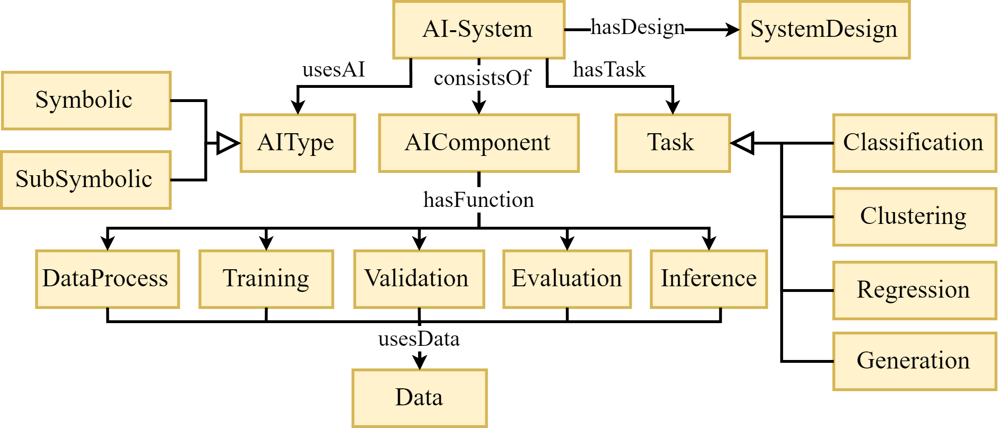
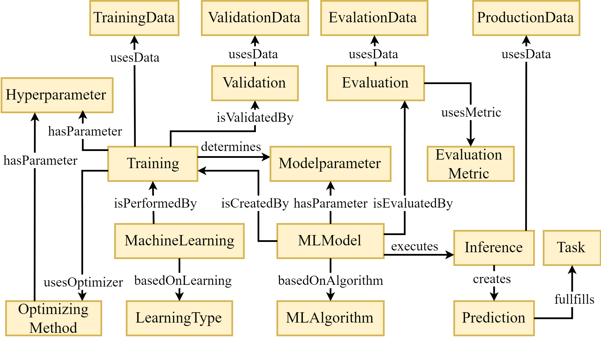
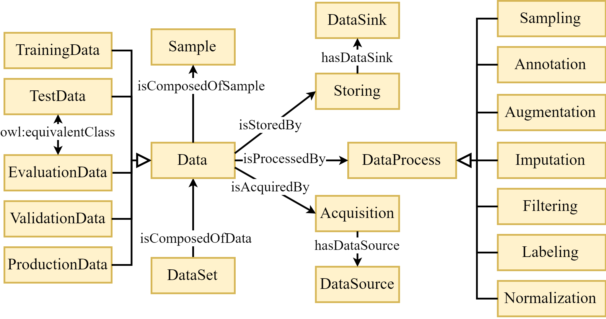

# Ontology Design Pattern of the ISO 22989

> [!NOTE]
> This repo and project is still under development.

The ISO 22989 proposed concepts and terminology for artificial intelligence and intelligent systems. The standard is structured around three aspects: *1.) components and functions*, *2.) algorithmic* and *3.) data*.

The basis of AI systems is described by the first aspect, shown in Fig 1. Following the concepts of ISO 22989, every AI System uses an Symbolic or SubSymbolic AI. Furthermore it has a specified design, for example a cloud design, an edge design or a hybrid design. The AI systems has at least one task, for example classification, regression or generation. Every AI system consists of several AI components, which are having different functions like Training, Evaluation, Inference or Data Processing. Every function uses and manipulates some kind of data.

| |
|:--:|
| Fig. 1: Viewpoint AI System|

Describing artificial intelligence in more detail with respect to the algorithmics and functions is part of the second aspect of ISO 22989, shown in Fig. 2. Following the concepts of the ISO 22989, for example every ML model is based on an ML algorithm and has modelparameter. Furthermore, a model is created by a training, which determines the modelparameter of the model. The training could be performed by machine learning, which is based on a learning type, for example supervised learning, unsupervised learning and reinforcement Learning. The training uses an optimizing method, for example gradient descent using several hyperparameter.

| |
|:--:|
| Fig. 2: Viewpoint Algorithm|

A central and crucial part of every ai application is data. Therefore, the third aspect of the ISO 22989 is describing data in more detail, shown in Fig. 3. This data is also used to connect the first and the second aspect. Based on this, data is composed of several Sample while a Dataset is composed of data. Data can be of a different type, for example to training data to train the model or validation data to validate a model after training. In addition, every data has a function and place to store it, and a function and place, where it gets acquired. The manipulation of the data, for example to pre- or postprocess it for the model, is described by the dataprocess.

| |
|:--:|
| Fig. 3: Viewpoint Data|
